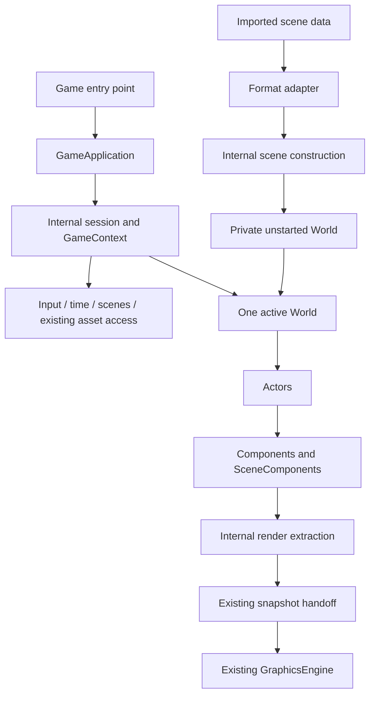

# Simplified AGP game framework plan

Research date: 2026-09-17. Status: proposed architecture and implementation handoff; no runtime implementation is part of this change.

## 1. Recommendation and reading guide

Keep the current framework's ownership and safety mechanisms, but make the engine operate them. A game should implement `IGame`, use `GameContext`, manipulate a `World` of composition-based `Actor`s, attach `Component`s, and request another scene by identifier. Loading must automatically create registered components, configure them, resolve references, validate the complete scene, and start gameplay. Gameplay code must never prepare, activate, flush, or transfer ownership of a world.

Continue from `8761675080371eb67abac8ed805c551360275cf5` on a new implementation branch when implementation starts. Do not restart from its parent. Simplify incrementally, retaining the existing renderer, host, checked-reference mechanism, and regression tests. Replace the lambda-based scene description as the lasting data boundary, and replace the public candidate-world factory with a scene service.

The everyday vocabulary is:

| Concept | Meaning |
| --- | --- |
| `GameApplication` / `IGame` | Engine-owned application host / game-owned session callbacks |
| `GameContext` | Session-scoped access to current world, input, time, scenes and existing assets |
| `World` | The one current live gameplay world; owns all actors |
| `Actor` | Named component container with a transform; owned by its world |
| `Component` | Owned behavior or engine feature; no independent transform by default |
| `SceneComponent` | Component with an offset and optional spatial parent |
| `ActorRef` / `ComponentRef<T>` | Checked, non-owning references for storage between callbacks |
| `Scenes().Load(id)` | Request scene replacement; returns before replacement occurs |

Use `Scene` for authored content and a scene identifier, not a second public live-object owner. Registration and scene adapters are application setup/extension APIs, outside the normal behavior-writing surface.

Sections 2–5 explain the evidence. Sections 6–18 define the target contract. Section 19 shows game code. Sections 20–26 cover migration, integration, tests, milestones, and decisions. Proposed names in examples are specifications, not claims that these APIs compile against today's checkout.

## 2. Evidence, scope, and limits

### Repository versions

- AGP inspected checkout: `deferred-rendering-optimisations`, HEAD `8761675080371eb67abac8ed805c551360275cf5`; clean before this document. The local tracking branch points to the same commit. No branch was changed, reset, or deleted.
- Direct parent inspected: `e7b63d687b341af5e8f3befb321b9ef3a60d2ef6`. The façade diff changes 38 files, with 1,747 additions and 613 deletions. It includes foundations, ModelViewer migration, tests, and small graphics changes, not just a wrapper header.
- Surrounding history inspected: `f274634` architecture map, `d78d9eb` formatting, `728a6a2` rendering phase extraction, `d5719a7` renderer documentation, `16168b3` optimization validation, and `66dd9e8` update/snapshot overlap. The host itself was introduced in `e7b63d6`; its parent is not a blank engine baseline.
- Root-Issue-Game inspected through GitHub at `a8669f55485ff8a4a2a0f343a3c1be92915605f5` (`main`, “hand in of game v1”, 2026-06-04). Source findings below refer to that revision, not older diagrams in its docs.
- Official Unity 6.0 and current Epic documentation were consulted on the research date. Epic pages served Unreal 5.8 documentation. These inform principles; AGP does not adopt their complete lifecycle or feature sets.

### AGP source and documentation map

| Evidence | What was checked |
| --- | --- |
| [Runtime headers](../Source/GameFramework/Runtime/GameContext.h), [host](../Source/GameFramework/Runtime/GameApplication.cpp), [GameLoop](../Source/GameFramework/Runtime/Internal/GameLoop.h) | Host ownership, callback ordering, input, scene commit, exception handling, worker shutdown |
| [World](../Source/GameFramework/World/World.cpp), [Actor](../Source/GameFramework/World/Actor.h), [handles](../Source/GameFramework/World/ObjectHandle.h) | Pending collections, generation checks, lookup, lifecycle, mutation and teardown |
| [Component](../Source/GameFramework/Components/Component.h), [SceneComponent](../Source/GameFramework/Components/SceneComponent.cpp), [transform operations](../Source/GameFramework/World/TransformOperations.h) | Connection, start/end, spatial attachment, local/world conversion |
| [SceneBuilder](../Source/GameFramework/Scenes/SceneBuilder.cpp), [SceneDescription](../Source/GameFramework/Scenes/SceneDescription.h), [registry](../Source/GameFramework/Scenes/ComponentRegistry.h), [ConnectionContext](../Source/GameFramework/Scenes/ConnectionContext.h) | What construction actually automates, and what is still application code |
| [Input](../Source/GameFramework/Input/GameInput.h), [diagnostics](../Source/GameFramework/Diagnostics/GameFrameworkLog.h) | Stable samples and logging versus exposed bookkeeping |
| [GraphicsEngine](../Source/Graphics/GraphicsEngine/GraphicsEngine.cpp) | `BuildRenderSnapshot`, component transforms, copied pose/light/camera data and shared render assets |
| [ModelViewer scene](../Source/Application/ModelViewer/ModelViewerScene.cpp), [behaviors](../Source/Application/ModelViewer/ModelViewerComponents.cpp), [game](../Source/Application/ModelViewer/ModelViewer.cpp) | Real public API burden, resource loading and debug controls |
| [Framework tests](../Tests/GameFramework/GameFrameworkTests.cpp), [host tests](../Tests/GameFramework/GameFrameworkHostTests.cpp), [optimization tests](../Tests/EngineOptimisations/EngineOptimisationsTests.cpp) | Existing coverage, headless versus graphics-dependent boundaries |

Read as design history: [Architecture](Architecture.md), [EngineDecisions](EngineDecisions.md), [EngineFoundationPlan](EngineFoundationPlan.md), [EngineOptimisations](EngineOptimisations.md), [GameFramework](GameFramework.md), [ImporterHandoff](ImporterHandoff.md), [framework README](../Source/GameFramework/README.md), and [root README](../README.md).

Important discrepancies: `GameFramework.md` still says handles, destruction and transitions are future work; the source implements them. `EngineDecisions.md` still describes component transforms as pending; current mesh extraction uses `SceneComponent::GetWorldMatrix`. The framework README describes `Scenes/` as future layout although it exists. Root README hotkeys also lag ModelViewer. Implementers must update these after each migration stage, rather than treating all older statements as simultaneous requirements.

The Perforce importer, its current headers, exporter implementation, PDF and sample JSON discussed in the old handoff were not available for direct inspection here. Claims about that format are explicitly **handoff assumptions requiring verification**, not newly verified facts. No importer contract is finalized by this document. No C++ build, test executable, GPU session, or performance measurement was run for this documentation task; coverage observations are source inspection, not fresh pass results.

## 3. Current AGP: preserve the mechanisms, reduce the exposed protocol

### Strengths

1. `GameApplication` already owns the window/graphics host and serializes all gameplay callbacks. `IGame` does not run command lists or own a worker. Threaded and synchronous execution use the same `Advance` and `GameLoop` path.
2. World → Actor → Component ownership uses `unique_ptr`. Components have stable addresses while alive. Checked handles hold a weak slot-table reference and generation, and reject pending-destroy objects. This addresses a real C++ lifetime problem without owning scene objects.
3. Pending actor/component collections prevent mutation from invalidating active iteration. A boundary before fixed steps prevents newly spawned objects joining later catch-up ticks in the same frame. Destruction suppresses later callbacks immediately.
4. Scene building creates all actors/components before configuration and connection, supports forward dependencies, validates before `BeginPlay`, and cleans up rejected candidates. Registry registration is explicit and detects duplicate type names.
5. Scene replacement stops gameplay before resource loading, preserves the old world on preparation failure, resets queued snapshots on commit, resets elapsed-time/input accumulation, and propagates callback exceptions through cleanup.
6. Actor hierarchy, same-actor spatial attachments, component world transforms, and explicit KeepLocal/KeepWorld semantics are already present. Cameras and lights use spatial world transforms; mesh bounds and shadows use the same placement as visible meshes.
7. CPU tests already exercise lifecycle, frozen additions, handles, hierarchy, registry and candidate validation. Separate real-host tests cover replacement and failures in both host modes. Keep these as a migration safety net.

### Why the façade feels complicated

The difficulty is chiefly that an internal construction protocol became the application programming model. ModelViewer registers built-in types itself, freezes a registry, creates `SceneDescription` records with configuration closures, accepts an input pointer in a scene factory, returns a `SceneBuildResult` containing an owned candidate world and camera, and uses `ConnectionContext` to wire string-named dependencies. The host hides workers, but asks the game to understand how a replacement world is manufactured.

`World` publicly exposes `State`, `Prepare`, `Activate`, `Flush`, `Shutdown`, ticking and `QueueStructure`. `GameContext.h` includes builder/world definitions and contains mutexes/atomics. `Actor.h` includes `TransformOperations.h`, which includes DirectXMath. The folder called `Internal` covers only the scheduler; it does not establish a reliable consumer boundary.

The existing `SceneDescription` is an executable C++ recipe: `std::function<void(Component&)> Configure` and captured resources. It is useful for an interim fixture but is neither plain importer data nor a property-loading contract. `ComponentRegistry` only creates components; it does not yet own property readers, authored-reference binding or built-in registrations.

The earlier foundation plan is not wrong for spelling out engine invariants. Its mistake would be making every detail a public concept or implementation prerequisite. EngineDecisions also mixes this foundation with events, pause, input redesign and future systems. This plan carries forward only the invariants necessary to construct, run and replace objects safely.

### Specific source issues to settle during implementation

These are bounded source findings, not claims of reproduced crashes:

- `Actor::GetComponent<T>` and `GetComponentsOfType` inspect committed components; `FindComponent(name)` also sees pending ones. Consequently `AddComponent<T>(); GetComponent<T>()` can behave differently during play. Make lookup semantics consistent.
- `GetLocalTransform()` exposes the mutable utility transform, including raw-parent assignment. Callers can bypass cycle/world validation or overwrite parent pointers by assignment. A safe `SetParent` method alone does not close this hole.
- `SceneBuilder` validates metadata transforms before arbitrary Configure closures. Closures and `Connect` can mutate structure or other objects. Preparation is therefore not a side-effect-free transaction by construction.
- `World::Flush` executes structural commands before validation. Discarding new objects after an error does not roll back successful edits to existing objects. Do not describe that operation as full transactional rollback.
- `SetParent` returns true for a queued request that may later fail. This is unintuitive for a normal setter and creates diagnostics plumbing for a simple transform edit.
- Scene building always requires a camera, including otherwise valid non-rendered scenes. Camera requirements belong to presentation policy, not general object construction.
- `SetVisible` currently delegates to `SetEnabled`. Hiding a skeletal mesh can stop its existing playback update. Separate visibility from component enablement when closing the render boundary.
- `OnActiveChanged` reports a local actor toggle, while `IsActive` calculates inherited activity. It is not an effective-activity notification for descendants. Avoid promising such notifications until implemented consistently.
- `MeshComponentBase` exposes mutable graphics assets and renderer-specific skinning access; ModelViewer directly creates materials through `GraphicsEngine::Get`. Ordinary behavior still has routes into rendering internals.
- `BeginBatch` marks begun only after `BeginPlay` returns. A throwing callback receives no `EndPlay`; partial resources must use RAII. Preserve an explicit failure rule instead of promising rollback after gameplay starts.

## 4. Root-Issue-Game: lessons from the team's previous implementation

All links in this section are pinned to the inspected revision.

### Actual pipeline

```text
.tgs + .leveldata objects (or packed cache)
  -> Tga::Scene / SceneObject
  -> merge SceneObjectDefinition properties and instance overrides
  -> SceneObjectData (typeId, name, TRS, std::any properties)
  -> resolve/parse .tgo prefab, merge defaults with instance values
  -> string factoryType selects a registered GameObject builder
  -> builder explicitly AddComponent<T>()s the composition
  -> State::ApplyLoadedScene calls object Init and owns the objects
```

[`Scene` and scene object sources](https://github.com/Troreen/Root-Issue-Game/tree/a8669f55485ff8a4a2a0f343a3c1be92915605f5/Source/Engine/tge/scene) describe authored objects, with a UUID-manager-derived integer key, shared SceneObject ownership, TRS, a definition name and property overrides. `SceneSerialize.cpp` reads/writes scene content and caches; it does not instantiate the game-side Component classes. `SceneObjectDefinition` supplies typed property definitions/defaults and flags for overrides. `SceneObject::CalculateCombinedPropertySet` applies matching instance values; a type mismatch has a TODO rather than a complete error contract.

[`SceneImportService`](https://github.com/Troreen/Root-Issue-Game/blob/a8669f55485ff8a4a2a0f343a3c1be92915605f5/Source/Game/source/SceneImportService.cpp) adapts these objects into [`SceneObjectData`](https://github.com/Troreen/Root-Issue-Game/blob/a8669f55485ff8a4a2a0f343a3c1be92915605f5/Source/Game/source/SceneObjectData.h). Its runtime data does not retain the Scene map's UUID as a runtime object identity. The properties are an unbounded `std::any` map; missing and wrong-typed values can both become defaults. The construction overload resolves prefab defaults, has asset-specific merge exceptions, catches errors per object, and can return a partial object list. An empty list also does not inherently distinguish a valid empty level from an import failure.

[`GameObjectFactory`](https://github.com/Troreen/Root-Issue-Game/blob/a8669f55485ff8a4a2a0f343a3c1be92915605f5/Source/Game/source/GameObjectFactory.cpp) dispatches by string; registration replaces an existing key rather than rejecting it. [`GameObjectFactoryRegistrations.cpp`](https://github.com/Troreen/Root-Issue-Game/blob/a8669f55485ff8a4a2a0f343a3c1be92915605f5/Source/Game/source/GameObjectFactoryRegistrations.cpp) explicitly composes objects. Automatic construction here means “select a builder which adds components,” not “deserialize an arbitrary list of registered component instances.” The large registration file combines object recipes, asset decisions, defaults and gameplay categories. AGP should register individual component types in small modules and keep any reusable game composition functions in the game.

[`GameObject::AddComponent`](https://github.com/Troreen/Root-Issue-Game/blob/a8669f55485ff8a4a2a0f343a3c1be92915605f5/Source/Game/source/GameObject.h) sets the owner and initializes immediately if its object is already initialized. That is approachable, but post-add setters can run after Init, and adding while iterating the component vector needs care. AGP's deferred start is a better foundation. Root-Issue's component base also contains Render, Reset and Save; these should not migrate into AGP's foundational behavior API.

### Loading, ownership and services

[`SceneManager::RequestScene(path)`](https://github.com/Troreen/Root-Issue-Game/blob/a8669f55485ff8a4a2a0f343a3c1be92915605f5/Source/Game/source/SceneManager.cpp) is the useful public shape: a caller expresses a destination. [`SceneLoadingService`](https://github.com/Troreen/Root-Issue-Game/blob/a8669f55485ff8a4a2a0f343a3c1be92915605f5/Source/Game/source/SceneLoadingService.h) explicitly separates plain `LoadedSceneData` from live `LoadedSceneObjects`. [`SceneTransitionController`](https://github.com/Troreen/Root-Issue-Game/blob/a8669f55485ff8a4a2a0f343a3c1be92915605f5/Source/Game/source/SceneTransitionController.cpp) keeps requested preparation, fades, one queued destination and passive preload together, and waits for futures before clearing state. Reuse the responsibility separation, not its fade/preload state machine. The “async safe” label is a contract to audit: its importer still calls engine property/definition/string facilities and caches.

[`State::ApplyLoadedScene`](https://github.com/Troreen/Root-Issue-Game/blob/a8669f55485ff8a4a2a0f343a3c1be92915605f5/Source/Game/source/StateStack/State.cpp) updates scene/camera/settings, clears nonpersistent objects, calls Init on new objects and takes ownership. State also draws loading screens through DX11 and restores Windows focus. [`GameWorld`](https://github.com/Troreen/Root-Issue-Game/blob/a8669f55485ff8a4a2a0f343a3c1be92915605f5/Source/Game/source/GameWorld.cpp) is largely a game-state dispatcher with hardcoded level paths and debug commands. Its header comment saying it manages all objects understates where actual ownership moved. The reusable engine should own scene-object storage, construction and teardown; game states should select levels and carry game rules.

[`Tga::Engine`](https://github.com/Troreen/Root-Issue-Game/blob/a8669f55485ff8a4a2a0f343a3c1be92915605f5/Source/Engine/tge/engine.h) makes time, render size and services easy to discover and owns engine resources. It also exposes singleton access, HWND, GraphicsEngine and frame control. [`Essentials`](https://github.com/Troreen/Root-Issue-Game/blob/a8669f55485ff8a4a2a0f343a3c1be92915605f5/Source/Game/source/Essentials/Essentials.h) improves convenience but combines static service ownership, a raw player pointer, spawn queues, enemies and game flags. Its constructor requires an already started Engine. This is a lifetime/order dependency, not merely a naming issue.

The [Object System Guide](https://github.com/Troreen/Root-Issue-Game/blob/a8669f55485ff8a4a2a0f343a3c1be92915605f5/Doc/Object_System_Guide.md) still documents manifest/enum dispatch and GameWorld ownership. The [Object Pipeline Refactor](https://github.com/Troreen/Root-Issue-Game/blob/a8669f55485ff8a4a2a0f343a3c1be92915605f5/Doc/OBJECT_PIPELINE_REFACTOR.md) correctly targets redundant type representations; current code already uses string factories and simpler prefab resolution. Neither document is an exact description of the inspected final game.

**Reuse:** plain-data/live-object separation, explicit composition, string registration, simple scene requests, and discoverable accessors. **Do not reuse:** global object queues, persistent scene actors as session storage, giant object factories, gameplay rendering hooks, permissive partial loads, or several nearly identical scene payload types. Do not import Root-Issue's prefab format or build a prefab system in this work.

## 5. Unity and Unreal lessons, with deliberate AGP differences

| Official evidence | Useful lesson | AGP decision |
| --- | --- | --- |
| Unity [GameObject](https://docs.unity3d.com/6000.0/Documentation/Manual/class-GameObject.html) and [Transform](https://docs.unity3d.com/6000.0/Documentation/Manual/class-Transform.html) | Composition, typed Add/Get, an always-present transform, local versus inherited activity are understandable. | Actor remains a component container with its own transform. Avoid a naming-only migration to GameObject. |
| Unity [Awake](https://docs.unity3d.com/6000.0/Documentation/ScriptReference/MonoBehaviour.Awake.html) and [Start](https://docs.unity3d.com/6000.0/Documentation/ScriptReference/MonoBehaviour.Start.html) | Separate reference setup from behavior start; do not assume another object's initialization order. | Resolve the whole construction batch before any BeginPlay. Keep AGP's explicit batch timing; do not copy Unity's inactive-object timing. |
| Unity [Destroy](https://docs.unity3d.com/6000.0/Documentation/ScriptReference/Object.Destroy.html) and [Object equality](https://docs.unity3d.com/6000.0/Documentation/ScriptReference/Object-operator_eq.html) | Destruction and reference availability have engine-defined semantics. A C# wrapper can exist after its native object is gone. | C++ has no equivalent managed safety automatically. Use checked non-owning references and deferred physical deletion. |
| Unity [LoadSceneAsync](https://docs.unity3d.com/6000.0/Documentation/ScriptReference/SceneManagement.SceneManager.LoadSceneAsync.html) | A caller supplies a destination and observes completion, without building a world. | Adopt that request shape. Initial implementation may load synchronously inside the host. AGP explicitly prepares before replacing; Unity Single mode is not evidence for AGP rollback. |
| Unreal [Actors](https://dev.epicgames.com/documentation/unreal-engine/actors-in-unreal-engine), [Components](https://dev.epicgames.com/documentation/en-us/unreal-engine/components-in-unreal-engine) | Nonspatial ActorComponent and spatial SceneComponent are distinct. Actors normally use a root component's transform; spatial attachment has no cycles. | Keep the useful distinction, but retain AGP's actor transform as the permanent root. No replaceable RootComponent protocol or cross-actor component attachments initially. |
| Unreal [Actor lifecycle](https://dev.epicgames.com/documentation/en-us/unreal-engine/unreal-engine-actor-lifecycle), [spawning](https://dev.epicgames.com/documentation/unreal-engine/spawning-actors-in-unreal-engine) | Loaded and spawned objects reach initialization and BeginPlay under world ownership. EndPlay covers removal beyond explicit destruction. | One construction/lifecycle implementation for both sources; no separate Actor subclass construction system. |
| Unreal [object pointers](https://dev.epicgames.com/documentation/en-us/unreal-engine/object-pointers-in-unreal-engine) | Weak references do not keep a target alive and must be checked. | Keep weak checked references; do not reproduce UObject garbage collection, reflected pointers or soft-object loading. |
| Unreal [subsystems](https://dev.epicgames.com/documentation/en-us/unreal-engine/programming-subsystems-in-unreal-engine) | Service lifetime can be tied to an owning scope, including a game instance. | Session owns the few existing services; components reach them through their world. No generic subsystem registration framework. |

The architectural inference is that discoverable ownership and a small object vocabulary matter more than reproducing either engine. Both engines support richer component registration and rendering machinery; AGP's standard mesh/camera/light usage should hide that machinery completely.

## 6. Proposed ownership and internal boundary



`GameApplication::Run` owns an internal session. `GameContext` is a non-owning view of that session, not the place to expose its mutexes or world smart pointers. A world owns actors, actors own components; parenting changes spatial relationships, not storage ownership. Session services outlive both the old world and a replacement being prepared. The caller owns `IGame` until Run returns.

One World and Actor implementation serves both gameplay and engine internals. Do not introduce parallel “public actor wrapper” and “real actor” object graphs. Hide operations with private members, internal access helpers and include boundaries. Pimpl is appropriate for `GameContext` and backend-heavy components; do not add one allocation per trivial value type just to conceal a field.

## 7. Public API versus engine machinery

| Current concept | Classification | Target |
| --- | --- | --- |
| GameApplication / IGame | Simplified public | Run/configuration and session hooks; game never ticks the world |
| GameContext | Simplified public | Scoped getters and requests; private session binding |
| GameLoop, workers, input mailbox | Internal | Preserve timing and failure semantics |
| World | Normal public | Spawn/find, current scene identity, camera selection, scoped services |
| World State / Prepare / Activate / Flush / Shutdown / phase dispatch | Internal | Host/construction access only |
| Candidate world / SceneBuildResult | Internal | No public world ownership transfer |
| Structural command queues / QueueStructure | Internal or removed | Pending additions/removals stay internal; eliminate general callable queue if reparenting is immediate |
| Actor | Simplified public | Composition, name, transform, parent, activity, lookup and Destroy |
| Actor/Component GetActors/GetComponents ownership vectors | Internal | Public borrowed query results, never unique_ptr containers |
| Component | Simplified public | BeginPlay, update hooks, EndPlay and scoped getters |
| Connect / ConnectionContext | Replaced with small opt-in extension | `ResolveReferences(References&)` for required sibling dependencies; serialized references handled by loaders |
| OnDestroy | Removed after compatibility migration | RAII handles failed construction; EndPlay handles gameplay cleanup |
| OnActiveChanged / OnEnabledChanged | Deferred as public hooks | Keep flags and effective queries; no mixed local/effective notification contract |
| SceneComponent | Normal public | Offset transform and validated same-owner attachment |
| Mutable CommonUtilities::Transform with SetParent | Replaced public exposure | Safe Transform facade; parentless value poses for copying/configuration |
| ActorHandle / ComponentHandle | Simplified public | `ActorRef` / `ComponentRef<T>`; preserve checked mechanism |
| ObjectHandle / slots / generations | Internal | Type-erased resolution backend, no public conversion between arbitrary handle kinds |
| SceneDescription with Configure closures | Replaced | Engine-side owned data plus registered readers; temporary C++ recipe shim only |
| SceneBuilder | Internal | Automatic construction invoked by scene service |
| ComponentRegistry | Setup extension API | Register game types/readers once; engine auto-registers built-ins and freezes |
| SceneDiagnostics | Internal collection; public read-only error report | File/object/component/field errors visible on load failure, not a parameter to everyday world operations |
| GameInput queries | Normal public | Existing key/mouse sample; Merge/ClearPressed are internal |
| Camera/mesh/light properties | Simplified public | Safe component properties and opaque existing-resource bindings |
| Camera synchronization, joint arrays, render extraction | Internal | Renderer integration only |
| Render diagnostics | Tool/application extension | ModelViewer controls stay outside ordinary gameplay API |

There are three audiences: behavior authors use ordinary public headers; application/component authors additionally use registration APIs; importer/backend integrators use an explicit integration header set. “Public” does not mean every game programmer must learn every extension API.

## 8. Application and game-session lifecycle

Keep `IGame::Initialize(GameContext&)`, optional FixedUpdate/Update/LateUpdate, and Shutdown. Add one optional `RegisterComponents(ComponentRegistry&)` setup hook. Engine built-ins register first; game registrations run next; engine freezes once before any scene construction. Static initialization macros, dynamic plugin discovery and generated reflection are unnecessary.

Startup sequence:

1. Validate application configuration; create host resources and session services.
2. Register built-ins and game types; freeze internally. Duplicate registration fails startup with a useful message.
3. Create the empty bootstrap world and call Initialize. A tiny program may compose this world directly. A level-based program requests its initial scene.
4. If a scene was requested, construct and commit it. Otherwise finalize the bootstrap world. Never activate the bootstrap and an authored scene together.
5. Start components and enter normal gameplay; publish only successfully started objects.

Normal phases stay: internal start-of-gameplay-frame mutation boundary; zero or more IGame FixedUpdate + component FixedUpdate passes; IGame Update; all component Update; all component LateUpdate; IGame LateUpdate; internal extraction. Existing 60 Hz default, 250 ms clamp and five-step cap remain internal policy. No new pause, time scale or tick-dependency scheduler in this task.

Callbacks are serialized; code may use ordinary mutable C++ state inside them. They are not guaranteed to use one permanent OS thread. Do not retain callback input samples or use actor pointers from background work. This short rule belongs in gameplay documentation; worker and queue implementation does not.

Preserve shutdown ordering for migration: stop gameplay; mark the session closing; call IGame Shutdown once if Initialize was entered, including partial initialization; end/destroy the world; release session services and rendering resources in their required order. The current world remains borrowable during Shutdown, but closing suppresses new spawns, additions and scene requests. Game-owned state required by component EndPlay must remain alive until Run returns; Shutdown must not prematurely destroy it. A failed registration before Initialize does not call Shutdown. Exceptions preserve the original failure and still join workers and clean up.

## 9. World, scenes, and session persistence

`World` is the public live container. `SceneId` identifies content, not a world object. An internal scene service stores the current identifier and source. There is one active gameplay world, plus at most one private unstarted replacement during loading. No public Scene class owning the same actors, no additive scenes, and no streamed sublevels.

`context.GetWorld()` borrows the current world. Do not retain that reference across callbacks that may straddle a load. Components use `GetWorld()` through their actual owner; during construction this is the candidate world, not the session's old active world. World ownership cannot move an existing Actor into a replacement.

Services, the IGame instance, game-owned session data and existing asset caches may survive replacement. Actors, components, camera selection and their runtime references do not. A persistent player's progress belongs in game-owned session data; a new level constructs a new player Actor. No `DontDestroyOnLoad` flag in this foundation.

The public `SceneService` offers `Load(SceneId)`, `Reload()`, `GetCurrentScene()`, and read-only last-load status/error. Load queues a request; success of the call does not promise success of the load. Last request before processing wins, including repeated identical IDs; Reload explicitly requests the current ID. Requests made during a successful new world's BeginPlay wait until the next host boundary. Shutdown ignores new requests. No callback captures of a candidate or input pointer are required.

An optional direct `IGame::OnSceneLoaded(GameContext&, SceneId)` and `OnSceneLoadFailed(GameContext&, const SceneLoadError&)` can report a completed request once. They are serialized session hooks, not a general event system. Completion runs after new components begin and before their first update. A callback can queue the next load without recursive construction. Initial load failure reports errors and exits startup; replacement preparation failure leaves the old world available.

## 10. Actor and component model

Keep the name `Actor` to reduce migration and match existing AGP vocabulary. Its semantics are primarily a Unity-like composition container. Make construction world-controlled and prohibit Actor inheritance for now; custom behavior derives from Component. `Actor` need not become a polymorphic gameplay base. A game can write ordinary helper functions that compose actors without creating an Actor factory hierarchy.

Every Actor owns exactly one permanent transform, even a controls-only actor. This small cost is preferable at the documented approximate 200–300 actor scale to optional-transform rules. Confirm scale with the team, but do not replace this design with an ECS without measurements.

`AddComponent<T>()` and `AddComponent<T>(name, constructorArgs...)` create and attach immediately, return `T*`, and never call BeginPlay inline. The no-argument overload generates a name; the named overload keeps constructor arguments unambiguous. Constructors only initialize local fields and RAII values: owner/services are unavailable until attachment. Adding by C++ type does not require scene registration; only authored construction needs it. Prefer default constructors and setters for scene-creatable types. An unusual constructor can be handled by an explicit registry factory without adding constructors to a giant switch.

SpawnActor/AddComponent return a nonnull borrow on normal success and null when the owner/session is ending or the owner is pending destruction. Duplicate explicit component names and invalid direct-C++ construction arguments are programming errors reported as exceptions; data construction catches them and converts them to diagnostics. Allocation failure propagates as a session failure. Direct C++ setters validate their own values; a failed transform/resource-binding setter leaves the old value intact. These rules keep the simple happy path concise without implying that construction cannot fail.

Allow multiple components of a type. Component instance names are unique within an Actor when provided; generate a unique internal name for unnamed code-created components. `GetComponent<T>()` returns the first matching live component in attachment order, including pending additions; `GetComponents<T>()` returns all; `FindComponent<T>(name)` selects an instance. None returns pending-destroy objects. Required type-only dependency resolution must find exactly one match; it never silently chooses the first. Normal lookup and required validation deliberately serve different needs.

Actors have a mutable display name and immutable runtime identity. Permit repeated display names for naturally spawned objects. `FindActor(name)` returns null and diagnoses ambiguity if more than one matches; `FindActors(name)` handles multiple results. Authored references use scene-local IDs, not display names. For a legacy import whose only identity is a unique name, the adapter captures that name as its immutable source ID at load. Renaming at runtime does not change it. No persistent GUID/save identity is invented here.

`SetActive` controls the Actor's local flag; `IsActiveInHierarchy` includes ancestors and pending destruction. Component enabled is a local flag, independently queryable. Effective participation requires actor activity, enabled, begun and not pending destruction. Disabling never removes ownership, changes stored references, or reruns BeginPlay. Spatial parent enablement does not disable spatial children; Actor hierarchy supplies group activation.

## 11. Transform and hierarchy design

The actor transform is the permanent root, not a removable SceneComponent. A parentless SceneComponent inherits that root. A spatial component may parent to another SceneComponent owned by the same actor. Actors may parent to actors in the same world. Cross-actor component attachment, sockets and replaceable roots are deferred. A nonspatial Component has no attachment API.

Expose a noncopyable framework Transform facade with local position/rotation/scale setters and queries, world position/matrix queries, and validated world-space setters. Its internal parent link is inaccessible. `LocalPose` is a parentless TRS value used when copying data through explicit GetLocalPose/SetLocalPose operations. Actor and SceneComponent expose `GetTransform()` using this facade; preserve explicit `Local`/`World` in method names. A copied utility Transform must never copy a borrowed parent pointer into scene data.

Keep the current row-vector convention: `world = local * parentWorld`. Support negative and nonuniform scale for local TRS and retain full composed world matrices, including induced shear. KeepWorld/world editing computes a local matrix and accepts it only if finite and representable as TRS; reject singular parent inversion or unrepresentable shear without changing either pose or parent. Zero local scale can exist, but cannot be used as an invertible parent. Do not silently approximate imported matrices. Camera view orientation must be normalized/orthonormalized with scale removed; light radius remains an explicit property rather than inherited scale.

**Simplification:** make `SetParent(parent, KeepLocal/KeepWorld)` apply immediately and return its actual result during serialized gameplay callbacks. This is safe with the current flat ownership/tick collections: changing a parent need not insert/erase the vectors being iterated, and the renderer reads copied state. No parent-change callbacks are added. Validate ownership, pending-destroy state, cycles and math first, then commit both links atomically. This replaces the current queued-true/later-error contract. If later systems require deferred attachment, revisit internally with explicit evidence; do not preemptively expose a structural queue.

An already admitted actor/component cannot attach underneath a still-pending actor/component: reject until the parent has been admitted at the next boundary. Pending objects can attach to each other or to existing parents. This prevents rejection of a new batch from cascading destruction into an existing live child. Track actor admission internally even for actors with no components. Effective activity changes immediately after a successful reparent; subsequent callbacks in the current frame use the new hierarchy. Frozen update membership remains unchanged.

Destroying an actor marks its actor subtree and all owned components. Destroying a spatial component marks its attached component subtree, matching the current foundation. To retain children, detach/reparent them first. Ordinary references are not ownership edges and do not propagate destruction. Teardown is child-first with reverse-start ordering among peers; detach internal transform pointers before freeing any target.

## 12. Component lifecycle and mutation rules

Normal behavior needs only BeginPlay, Update/FixedUpdate/LateUpdate as needed, and EndPlay. There is no public Awake/Initialize/Activate/Start quartet.

| Phase | Contract |
| --- | --- |
| Construct and attach | Allocate fields, assign owner/identity, expose configuration setters; no gameplay |
| Configure | Apply all scalar/resource properties; record authored reference bindings |
| Resolve and validate | Resolve every authored reference, then run optional `ResolveReferences(References&)` for sibling requirements and local invariants; no external side effects |
| BeginPlay | Called once only after the complete batch is valid; owner/services and configured peers exist |
| Update phases | Only begun, enabled components on active actors participate |
| EndPlay | Once if BeginPlay completed, on destruction, scene replacement or session end |
| Destructor | RAII cleanup for every allocation, including components that never began |

Preserve the existing policy that BeginPlay also runs for initially disabled/inactive components. Enabled/activity gates ticking and rendering, not the one-time readiness pass. This is intentionally different from Unity Start. BeginPlay must not assume a peer's BeginPlay has run. Reference resolution guarantees existence/type/configuration, not start order. A game requiring coordinated post-start work can use the scene-completed session hook rather than introduce a dependency scheduler.

Keep `ResolveReferences(References&)` as an opt-in component-author extension because pre-start validation of code-created sibling requirements is useful. It exposes only typed required/optional lookups and error reporting, not world activation or construction state. Most components omit it. It cannot spawn, destroy, reparent, load a scene, start gameplay or mutate peers; guard structural operations during resolution and turn misuse into a construction error. This restriction is a deliberate correction to today's reentrant Connect behavior, not an obligation on ordinary Update code.

The host freezes one pending-addition batch at the beginning of each gameplay frame. All currently queued additions are configured and resolved together; only then do they begin. Additions from BeginPlay, update or ordinary EndPlay enter the next frame's batch. Nothing created during a fixed catch-up sequence ticks in that same frame. Startup's complete scene has its own construction batch before the first frame. Startup BeginPlay additions wait for the first normal boundary.

Destroy marks logical death immediately, including descendants. Ref resolution and lookup return null, subsequent callbacks and new snapshots skip the target, and an already running method may finish. Memory is retained until the next internal collection boundary. Repeated Destroy is harmless. Destroy-before-begin runs neither BeginPlay nor EndPlay. Raw borrows must be discarded after Destroy, even though the allocation has not yet been freed.

Invalid runtime additions: reject the frozen new-addition batch with diagnostics, destroy its new actors/components, and keep existing active objects. This initial coarse policy is sufficient; do not build a generalized transaction graph. Explicit destruction or property edits already requested by gameplay are not rolled back. The resolver is read-only with respect to existing objects, so validation itself cannot partially reparent the live world. Old required references may become null after later removal; consumers must handle that normally.

BeginPlay exceptions after commit are fatal session errors with orderly teardown; there is no rollback to an already ended scene. Only completed BeginPlay calls are paired with EndPlay. EndPlay errors are logged and cleanup continues. Destructors are nonthrowing; partially initialized resources must use RAII. Remove OnDestroy after checking all callers; do not simply delete it before moving never-started cleanup into destructors.

## 13. References and lifetimes

Keep the existing checked-reference requirement and implementation approach. Use short public names `ActorRef` and `ComponentRef<T>` (a temporary alias for existing handles is sufficient initially). `actor.GetRef()` and `component.GetRef<T>()` produce refs; `.Get()` returns a nullable temporary pointer. No implicit owning conversion, no serialization of the runtime handle, and no unchecked implicit pointer conversion.

Internally retain a weak world token/slot table and generation; hide its layout and prevent public actor/component handle cross-construction. Reuse slots only with an updated generation; on eventual generation wrap, retire the slot instead of reviving an ancient ref. A ref never keeps a world or actor alive and never resolves into a replacement world. This mechanism is not a cross-thread lock or borrow guard: resolve/use only inside the serialized gameplay domain.

Raw `Actor*`/`Component*` are acceptable local borrows while composing objects or executing a callback. Store a Ref in fields, delayed work and session state. `World&`, input views and transform references are borrowed too; they are not persistent handles. An authored object/component ID is a separate loading-time address resolved once into a Ref. Assets have separate resource ownership semantics; do not force them through scene object slots.

This costs an explicit null check when retaining an optional/destroyable peer. It avoids a much larger change to garbage collection or pervasive shared ownership. Keep vectors and dynamic_cast for the current scale unless measurement establishes a bottleneck.

## 14. Registration, properties and automatic component creation

### Registry ownership

One session-owned `ComponentRegistry` maps stable names such as `agp.StaticMesh` or `sample.Spin` to create/configure functions. The template helper creates a Component owned by its Actor. Each registration optionally provides a small explicit reader for that type's authored fields. A name is not a C++ RTTI string, exporter numeric ID, object identity or prefab identifier.

The engine registers its built-ins in one engine module. The game's `RegisterComponents` hook calls small registration functions next to its components. Duplicate/empty type names are errors; freezing happens inside startup. Normal game code never calls registry Create or Freeze. Adding a custom component requires its C++ class and one registration; it does not change the importer, scene builder or engine switch statement. A format adapter may have a small table for the exporter's finite built-in TypeIDs; that table must not become the registration mechanism for game types.

The proposed extension signature is conceptually:

```cpp
registry.Register<SpinComponent>("sample.Spin",
    [](SpinComponent& component, SceneReader& fields)
    {
        component.SetDegreesPerSecond(fields.OptionalFloat("speed", 25.0f));
    });
```

`SceneReader` provides checked property reads, range/error reporting, and deferred reference bindings. It is not a JSON DOM or the Perforce importer type. Its callback runs after all components are allocated, but reference targets are assigned in a later pass. Absent optional fields take documented defaults; present wrong-typed fields are errors. Numeric conversion may accept an integral numeric literal for a float after finite/range checks. Do not silently accept arbitrary strings as numbers.

A reader tracks consumed fields; leftover gameplay properties fail validation. Format metadata belongs outside that property view, so exporter metadata is not accidentally treated as a gameplay typo. Validate camera projection, finite TRS, light values, asset validity and material-slot bounds before calling backend methods that currently assume valid input. Defaults should be shared with C++ component defaults, not independently duplicated across importer and registry code.

For authored cross-object references, `fields.BindActor("target", component.Target, ReferenceRequirement::Required)` or `fields.BindComponent<T>("mesh", component.Mesh, ReferenceRequirement::Optional)` records a typed binding into an internal fixup list. The destination is a Ref field on a candidate component, never a stack temporary. A binding is resolved after all configuration, uses scene-local IDs and verifies the target type. No reference token or property-reader object survives in normal component gameplay state. The builder retains candidate ownership until all fixups complete and discards fixups before freeing components on failure.

Code-created components use ordinary setters to store Refs; optional `ResolveReferences(References&)` fills or validates required siblings. For example, `refs.Require<SkeletalMeshComponent>("Body")` must resolve exactly one sibling named Body. Optional missing reference data is allowed; a supplied invalid target is always an error. Dependencies form ordinary links, so cycles between references are legal; only parenting cycles are forbidden. There is no topological BeginPlay scheduler.

### Minimum engine-side data contract

Replace executable configuration closures as the lasting scene input. The **AGP-owned** scene input contains owned values, identifiers and source locations, with no Actor/Component pointers, input pointer, candidate world, GPU objects or arbitrary executable callbacks:

| Record | Required meaning |
| --- | --- |
| SceneData | Ordered actors; source/version metadata; optional explicit active-camera address |
| ActorRecord | Scene-local immutable ID; display name; optional parent Actor ID; engine-space parent-local pose; active flag; ordered component records |
| ComponentRecord | Actor-local immutable ID; instance name; registered type name; enabled flag; optional spatial parent ID; optional local pose; owned property payload |
| ObjectAddress | Actor ID, and Component ID when addressing a component; no live pointer |
| SourceLocation | Scene/file and source object/component/field path used in diagnostics |

Nonspatial components reject transform/attachment fields rather than silently discard them. Preserve input ordering for deterministic attachment and tick order; never rely on unordered-map traversal for gameplay order. Resolve references by IDs even when display names repeat.

For the initial engine fixture implementation, use a small typed value map behind SceneReader: bool, signed integer, floating number, string, Vector3, Quaternion, color, asset identifier, object/component address, and ordered lists only where a built-in needs them (for example material slots). Reject unsupported values; do not implement recursive arbitrary object schemas, reflection, code generation, editor widgets or automatic C++ member discovery. The exact storage type is an AGP implementation detail and can be adjusted after seeing Perforce. Prefer adapting a compatible existing representation over converting it twice. The semantic boundary above is fixed; **the importer-owned C++ layout and serialized schema are not**.

No new JSON parser or prefab inheritance format is required to test this. A C++ source can emit SceneData fixtures with the same semantics. Remove the old Configure-lambda bridge once ModelViewer uses the reader registrations. Game-specific repeated compositions can remain ordinary C++ functions; a future prefab feature would produce this same input, but is not a milestone here.

## 15. Scene data to a live world

```mermaid
flowchart LR
    A[Authored export] --> B[Team importer]
    B --> C[Importer-owned data]
    C --> D[AGP adapter]
    D --> E[SceneData]
    E --> F[Validate identities and types]
    F --> G[Allocate all actors and components]
    G --> H[Apply configuration and hierarchy]
    H --> I[Resolve references and validate]
    I --> J[Prepared private world]
    J --> K[Host commits replacement]
    K --> L[BeginPlay then gameplay]
```



| Stage / owner | Responsibility | Failure behavior |
| --- | --- | --- |
| Exporter / content team | Author identities, properties, attachments, source asset references and conventions | Report authoring errors; no runtime construction |
| Importer / importer team | Parse the source, preserve concrete payloads/metadata, return owned source data and parse diagnostics | Explicit failure distinct from a valid empty scene |
| Adapter / engine integration with importer team | Map supported types, units/axes/transform spaces, source references and asset identifiers into AGP semantics | Return source-addressed adaptation errors; no changes to active world |
| Scene service / engine | Resolve SceneId to source, invoke import/adapter, coordinate resource preparation and construction | Retain old world until complete preparation succeeds |
| Runtime constructor / engine | Preflight IDs/types, allocate/own objects, apply hierarchy, invoke type readers, resolve all references, validate | Destroy candidate without BeginPlay; return aggregated report |
| Registry / engine and game extensions | Select C++ component class and its explicit property reader; define local defaults and validation | Unknown type, invalid configuration or duplicate registration are errors |
| Host / engine | Commit replacement and call lifecycle; maintain scheduling/render/resource lifetime | Fatal cleanup if gameplay fails after commit; no false rollback guarantee |

Detailed internal algorithm:

1. Obtain owned SceneData and all required asset identifiers. Check uniqueness of Actor IDs, component IDs/names, registered types, legal parent scopes, finite transforms and reference syntax. Collect independent errors with file/actor/component/field context. Avoid cascading errors that merely repeat a missing object.
2. Resolve required render assets using the current asset-loading backend at its safe host point. Resources returned for scene configuration must be ready and stable. Missing mesh/material data is an explicit error unless that exact property is documented optional. This does not require asset streaming or a new cache.
3. Allocate every Actor and Component into a private World using the same attach path as `SpawnActor`/`AddComponent`. Map authored IDs to runtime refs. All types exist before configuration starts.
4. Apply value properties, local active/enabled flags and already-resolved resource bindings through registry readers. Readers may configure only their target and register fixups; they cannot perform gameplay or mutate active-world resources. Resolve hierarchy independent of record order, with cycle checks and validated TRS conversion. Configuration never starts ticking.
5. Resolve recorded authored object/component references. Then call optional component ResolveReferences to validate sibling requirements, explicit code-provided refs and local invariants. All settings and hierarchy are complete before this pass. Do not call BeginPlay if any errors exist.
6. Validate presentation policy: if a rendered scene declares a camera, it must identify a live enabled CameraComponent on an active actor. ModelViewer requires one; pure CPU scenes do not. The generic builder does not require a graphics device.
7. Return a prepared private World to the host internally. On failure, release fixups and candidate allocations; only RAII destruction runs. No EndPlay for never-started objects, no scene-completed notification, and no publication.
8. Commit via section 16. Only then call BeginPlay and expose the new current scene. Record successful BeginPlay callbacks so partial failure cleanup pairs them correctly.

Runtime spawning skips the file/import/registry-reader steps when configured through C++ setters, but shares allocation, ownership, validation, reference resolution, beginning, ticking and destruction. It is not a second lifecycle. A runtime mesh swap only accepts a prepared asset reference; it must not call synchronous GPU loading from a gameplay callback.

## 16. Loading and replacement implementation

First delivery uses the current synchronous loading opportunity: pause/join gameplay at a host boundary, prepare resources on the platform thread, and finish the replacement before resuming updates. No background-loading claim, fade implementation, progress UI or new worker pool is needed. A static last frame may remain visible while loading; the public API does not promise an animated loading screen or uninterrupted window pumping during a long import. Measure actual fixture load times before adding asynchronous parsing.

Internal sequence:

1. Consume the latest request and stop gameplay at a boundary. Finish any current render recording work before resource mutation. Clear pending request ownership without exposing callbacks to the game.
2. Import, adapt and prepare a private world while the old world and its last snapshot remain owned. Use the same session services but world-local object lookup. Never let candidate validation use `GameContext::GetWorld()` to resolve peers in the old active scene.
3. On preparation failure, dispose of candidate-only data/resources and publish a load error. Keep the old world, camera, current SceneId and valid snapshot. Reset timing/input transients and resume it. Required asset preparation must not modify shared materials used by the old scene, otherwise preservation would be incomplete.
4. On success, cross the commit point: EndPlay/tear down the old world; invalidate all its runtime refs; discard old queued snapshots; install the new world/camera/SceneId; BeginPlay the new components; deliver OnSceneLoaded; extract the first new snapshot; resume gameplay. Suppress scene requests while ending the old world; accept requests again from the new world's BeginPlay for the next boundary. No old snapshot can be submitted after commit. Already submitted GPU work keeps resources alive through the renderer's existing lifetime rules.
5. Reset fixed accumulation, queued elapsed time, press edges and mouse motion on success or recoverable load failure. Loading duration must not become simulation catch-up. Refresh held input from the next platform sample.

Default failure policy changes from today's unconditional development assertion: data/import/validation failures return structured errors and retain the old scene in both Debug and Release. The host logs once and optionally invokes OnSceneLoadFailed. Assertions remain for violated engine invariants, not recoverable bad content. A developer opt-in break-on-load-error can live in internal debug configuration. This is a proposed change to EngineDecisions E15, to be recorded when adopted; tests should not depend on dismissing assertion dialogs to exercise normal failure handling.

For an initial load failure there is no gameplay scene to retain: report it, run partial session cleanup, and return a nonzero startup result. Do not fall through to an empty bootstrap world and pretend the requested level loaded. A post-commit BeginPlay or completion-hook exception shuts down the session rather than reviving ended objects. Pending requests must be destroyed before any captured integration resources, although the new ordinary request stores only a SceneId.

A destroyed/disabled current camera does not authorize retaining an old scene image indefinitely. The bridge publishes an empty presentation frame or clears through the existing renderer path, diagnoses once, and keeps the host responsive until a valid camera is selected. This is presentation handling, not a requirement that every World have a camera. Repeated renderer initialization across multiple Run calls remains unsupported unless separately verified; CPU session tests must not depend on a global renderer reset.

## 17. Importer and Perforce boundary

An integration-only `ISceneSource` (or an existing equivalent found in Perforce) receives a SceneId and returns `SceneData` or errors. Its implementation owns calls to the team importer and the format adapter. It cannot return live runtime actors or demand that gameplay include importer headers. The scene service owns the source for the session; source/parser/cache lifetimes are explicit. Tests inject an in-memory or failing source. ModelViewer supplies a C++ data source until the real importer is integrated.

Do not require the importer to instantiate C++ components, invoke engine registration, know BeginPlay, resolve runtime handles, or allocate GPU resources. Do require it to preserve the information needed for adaptation. Engine component readers own runtime property semantics. Exporter-specific aliases, numeric IDs, Unreal asset paths and coordinate conversion live in the adapter. Game code registers stable component names; an authored custom component needs an agreed mapping to one of those names and its payload. An Unreal Archetype name alone cannot execute Blueprint behavior or unambiguously select an AGP composition.

### Verification required before binding the real importer

| Team question | Why it matters / provisional action |
| --- | --- |
| Which Perforce changelist and headers are current? | GitHub is incomplete. Obtain a pinned code/data snapshot and identify importer/asset/input owners before integration edits. |
| Does it return plain owned data or already create resources/runtime objects? | Prevent duplicated responsibilities; wrap legacy resource preparation explicitly if needed, do not assume it is safe off-thread. |
| How are derived component payloads stored? | Old handoff warns about `vector<ComponentData>` slicing. Verify variant/ownership in actual code; preserve mesh/light/custom fields. |
| How are custom types and properties identified? | Old handoff mentions signed TypeID -1. Agree on stable custom name + payload preservation and error behavior. Without this, automatic custom-component construction from export is blocked. |
| What are Actor/component IDs and reference scopes? | Names may be the only IDs in the old export. Validate uniqueness; distinguish references from editable labels. Do not invent persistent GUID semantics. |
| Are component transforms actor-relative or immediate-parent-local? | Old handoff says actor-relative. Verify nested examples and conversion ownership; applying them as local can double-transform descendants. |
| Units, handedness, axes, vector/matrix multiplication, layout and angles? | Row storage does not establish multiplication convention. Convert once in the adapter and verify expected world matrices. |
| Can source matrices contain shear or singular scale? | AGP stores local TRS. Reject unsupported conversions with source context; agree on authored constraints rather than losing information. |
| How are asset identifiers resolved and prepared? | Unreal ContentPath is not necessarily a filesystem path. Reuse the asset team's mapping and ownership; avoid a second asset manager. |
| Material slots and parameter types? | Preserve ordered slots and scalar/color/texture distinctions; do not confuse material-parent metadata with component attachment. |
| Light units and camera properties? | Old handoff lacks intensity conversion. Never guess a photometric conversion ratio; compare a fixture visually and numerically with team expectations. |
| Does parse failure have an explicit result and source locations? | An empty vector must not masquerade as success. Wrap legacy errors if needed; reject partial scenes. |
| Which exported component types are supported now? | Explicitly reject unknown runtime types. A documented adapter mapping may preserve a transform-only node while omitting a specifically agreed non-runtime feature; never silently discard arbitrary data. |

If the old actor-relative convention is confirmed and matrices have already been converted to AGP coordinates, the current row-vector formula is:

```text
componentParentLocal = componentActorRelative * inverse(parentActorRelative)
componentWorld      = componentParentLocal * parentComponentWorld
```

A parentless component uses its actor-relative matrix directly. Apply this only once. Test a three-component chain with translated, rotated, nonuniformly scaled actor and nonidentity child offsets; compare explicit expected world matrices. The old 16-actor sample described in ImporterHandoff has only parentless components and cannot establish this correctness.

### Integration sequence

Agree on semantics and fixtures first; no need to block the object core on parser delivery. Keep a small engine-facing adapter compiled separately from public gameplay headers. Pin both AGP commit and Perforce changelist in an integration note, map conflicting file moves before landing them, and run the same SceneData conformance tests through C++ and real-import sources. Port the small framework changes in dependency order; do not overwrite the Perforce importer with GitHub-era assumptions. If Perforce already supplies a compatible asset/input facade, bind it behind GameContext instead of introducing a competing one.

The integration gate needs: source headers, one representative valid export, nested transforms with expected matrices, multiple same-type components, a custom gameplay component payload, missing/unknown types and references, malformed data, material-slot ordering, and asset-resolution failures. Until that gate passes, describe authored importer support as pending even if the C++ scene source and automatic component construction work.

## 18. Service access, renderer boundary, and header organization

### Scoped services

GameContext exposes explicit, discoverable getters, not a growing list of public mutable service pointers. Components get World, Input, Time and Scenes through their owner/world binding; they do not require a GameContext constructor parameter. Keep game-specific session data on the IGame object or an explicitly supplied game service, not in engine globals.

| Access | Scope and behavior |
| --- | --- |
| `GetWorld()` | Current live World in session callbacks; component's own World in component callbacks |
| `GetInput()` | Read-only existing key/mouse sample, valid for the callback. Fixed and variable input domains retain today's separate edge semantics. |
| `GetTime()` / callback `dt` | Read-only session timing view; callback dt remains the easiest local input. No new pause/action system. |
| `GetScenes()` | Session-owned request/status service; component convenience getter forwards through its world |
| `GetAssets()` | Narrow access to already prepared existing resources through opaque bindings. No implicit GPU load during Update. |
| Logging | Existing category logger; a public lightweight include may forward to it. No new logging subsystem. |
| `GetClientSize()` | Current exposed client-size value; do not promise resize propagation before it is wired. |

No `Engine::Get()` singleton in normal gameplay, no `Essentials`, and no generic `GetSubsystem<T>` plugin container. Scoped explicit getters give Tga::Engine-like discoverability while making lifetime and test substitution clear. CPU tests bind an internal test session with stable input/time, an in-memory source and fake resource bindings; they do not initialize a global graphics engine.

### Rendering

Keep snapshots and all existing render passes. Introduce one internal `WorldRenderBridge` which traverses the world after gameplay and builds the renderer input. Move world traversal out of `GraphicsEngine::BuildRenderSnapshot` into this bridge in a mechanically verified step. Renderer-side culling, routing and preparation can remain helper functions consuming copied inputs. Do not redesign shaders, shadow scheduling, RHI or GPU synchronization.

The desired dependency direction is:

```text
Gameplay -> GameFramework public API
Host / internal WorldRenderBridge -> World implementation + GraphicsEngine snapshot API
GraphicsEngine rendering -> copied render data and shared resources
```

GraphicsEngine must ultimately not include World/Actor/Component headers. The old `Render(commandList, cameraActor, world)` convenience wrapper is a temporary internal compatibility path and is removed or relocated with traversal. The bridge can access private component resource and pose data through a narrowly scoped internal accessor, not public `GetJointTransforms` or GPU objects.

Public StaticMesh/SkeletalMesh bindings are opaque `MeshAsset` and `MaterialAsset` values wrapping the existing retained resources. This is API encapsulation, not a new asset storage/loading/unloading system. SetMesh/SetMaterial choose ready resources; they do not mutate shared backend meshes/materials. Existing skeletal playback methods remain for ModelViewer compatibility; animation redesign is deferred. Shadow bias/pass controls and material authoring remain in the ModelViewer integration/tool layer.

Copy transforms, camera projection/view, light properties and current joint poses into extraction data. Shared resource contents remain stable while a snapshot can use them. A component can change its binding; old snapshots retain the old resources. Scene replacement and CPU destruction must not release resources still owned by snapshots or submitted rendering work. Use existing renderer retention mechanisms and test them; actor handles do not solve GPU lifetime.

Rendering eligibility requires begun, not pending-destroy, enabled, active owner, and visibility where appropriate. SetVisible changes render contribution only; SetEnabled also suppresses the component's update. Camera synchronization is internal, after final gameplay transforms. Immediate logical destruction affects the next extracted state, not a frame already submitted to rendering.

### Public and private headers

Proposed final organization (paths not yet created):

```text
Source/GameFramework/
  Public/GameFramework/
    GameApplication.h   IGame.h       GameContext.h
    World.h             Actor.h       Component.h
    SceneComponent.h    Transform.h   ObjectRef.h
    GameInput.h         GameTime.h    SceneService.h
    Components/CameraComponent.h
    Components/StaticMeshComponent.h
    Components/SkeletalMeshComponent.h
    Components/LightComponent.h
    Assets/AssetRefs.h
    Diagnostics/Log.h
    Registration/ComponentRegistry.h
    Registration/SceneReader.h
    Registration/References.h
  Integration/GameFramework/Integration/
    SceneData.h         ISceneSource.h    ApplicationSetup.h
  Private/
    Runtime/            World/           Scenes/
    Components/         Rendering/       ImportAdapters/
```

Ordinary consumers receive only Public and the shared math include path. Integration code separately opts into Integration; engine sources/tests may use Private. Keep the current static-library project initially; a new multi-library build architecture is unnecessary. Move definitions gradually with forwarding headers confined to the migration. C++ access control must enforce host-only operations; directory names alone cannot do it.

Add a small compile-only gameplay consumer that includes each public header without GraphicsEngine, D3D/RHI, platform-window or Private include paths. Inspect transitive includes as well as direct includes: Actor currently pulls DirectXMath via TransformOperations. The safe Transform facade must move that implementation to a cpp/internal header. Shared math can still use its existing implementation internally; do not replace the math library.

ModelViewer may have a separate integration translation unit that includes GraphicsEngine for its current asset/debug needs. That exception does not make GraphicsEngine a normal gameplay dependency. Update vcxproj/filter/include entries with each move and retire forwarding headers when ModelViewer and tests migrate.

## 19. Game-code happy path

These are proposed API examples, to become a compile-tested sample during implementation. They use only the vocabulary defined above. `CommonUtilities::Vector3f` may be locally aliased for brevity. They do not pretend an authored level will load before a scene source is installed.

### A minimal program with no importer or registry boilerplate

```cpp
#include <GameFramework/GameApplication.h>
#include <GameFramework/IGame.h>
#include <GameFramework/GameContext.h>
#include <GameFramework/World.h>
#include <GameFramework/Actor.h>
#include <GameFramework/Components/CameraComponent.h>

class MinimalGame final : public IGame
{
public:
    void Initialize(GameContext& game) override
    {
        auto* cameraActor = game.GetWorld().SpawnActor("Camera");
        cameraActor->GetTransform().SetLocalPosition({0, 100, -400});
        auto* camera = cameraActor->AddComponent<CameraComponent>();
        camera->SetPerspective(90.0f, 1.0f, 50000.0f, game.GetClientSize());
        game.GetWorld().SetActiveCamera(camera);
    }

    void Update(GameContext& game, float) override
    {
        if (game.GetInput().IsKeyPressed(Keys::ESCAPE)) game.RequestQuit();
    }
};

// Called from the existing platform entry-point wrapper.
int RunGame(const std::filesystem::path& contentRoot)
{
    MinimalGame game;
    GameApplication::Config config;
    config.Title = L"AGP sample";
    config.ContentRoot = contentRoot; // Includes the existing engine shaders.
    return GameApplication{}.Run(game, config);
}
```

### A custom behavior, transform editing and existing input

```cpp
#include <GameFramework/Component.h>
#include <GameFramework/Actor.h>
#include <GameFramework/GameInput.h>
#include <cmath>

class SpinComponent final : public Component
{
public:
    void SetDegreesPerSecond(float value) { mySpeed = value; }

    void FixedUpdate(float dt) override
    {
        if (GetInput().IsKeyPressed(Keys::R)) mySpinning = !mySpinning;
        if (!mySpinning) return;
        myYaw = std::fmod(myYaw + mySpeed * dt, 360.0f);
        GetOwner()->GetTransform().SetLocalRotationDegrees(myYaw, 0, 0);
    }

private:
    float mySpeed = 25.0f;
    float myYaw = 0.0f; // This sample owns rotation of an initially unrotated actor.
    bool mySpinning = true;
};
```

Choose one input phase for a toggle; handling R in both FixedUpdate and Update would deliberately observe the same physical press in both sample domains. The sample needs no constructor service injection or lifecycle hook beyond its update.

### Spawn, add, find, retain and destroy

```cpp
// A field on an IGame or Component, not an owning pointer.
ActorRef myMarker;

void CreateMarker(GameContext& game, MeshAsset meshAsset)
{
    World& world = game.GetWorld();
    Actor* actor = world.SpawnActor("Marker");
    actor->GetTransform().SetLocalPosition({100, 0, 250});

    auto* mesh = actor->AddComponent<StaticMeshComponent>("Visual");
    mesh->SetMesh(meshAsset); // Already prepared through existing asset access.
    actor->AddComponent<SpinComponent>("Spin")->SetDegreesPerSecond(40.0f);

    auto* sameMesh = actor->GetComponent<StaticMeshComponent>();
    sameMesh->SetVisible(true); // Finds the pending component immediately.
    myMarker = actor->GetRef();
    // BeginPlay occurs automatically before its first eligible gameplay frame.
}

void RemoveMarker()
{
    if (Actor* actor = myMarker.Get()) actor->Destroy();
    // myMarker.Get() is now null; scene replacement has the same invalidation effect.
}
```

`GetAssets().FindMesh(id)` returns an already prepared MeshAsset (or an empty result/error); preparation belongs to initial/scene loading. Material assignment follows the same binding pattern. A behavior uses `GetWorld()` instead of passing GameContext into every constructor. To find a named actor, use `GetWorld().FindActor("Player")`, check it, then keep its GetRef. A required authored reference is preferable to repeated name searches.

### Store a reference to another object and use a resolved dependency

```cpp
class FollowTargetComponent final : public Component
{
public:
    ActorRef Target; // Can be assigned from scene data or ordinary C++ code.

    void LateUpdate(float) override
    {
        if (auto* target = Target.Get())
        {
            const auto position = target->GetTransform().GetWorldPosition();
            GetOwner()->GetTransform().SetWorldPosition(position);
        }
    }
};

class AnimationControlsComponent final : public Component
{
protected:
    void ResolveReferences(References& refs) override
    {
        myBody = refs.Require<SkeletalMeshComponent>("Body");
    }

    void Update(float) override
    {
        if (auto* body = myBody.Get(); body && GetInput().IsKeyPressed(Keys::NUMPAD0))
            body->PlayAnimation("Breathing", true);
    }

private:
    ComponentRef<SkeletalMeshComponent> myBody;
};
```

The follow example leaves position unchanged if its target disappears or a world-space edit is rejected. A production behavior can inspect the setter result and choose its own fallback. Required references guarantee valid initial composition, not immortal peers.

### Register game types and request an authored scene

```cpp
class SliceGame final : public IGame
{
public:
    void RegisterComponents(ComponentRegistry& types) override
    {
        types.Register<SpinComponent>("sample.Spin",
            [](SpinComponent& c, SceneReader& data)
            {
                const float speed = data.OptionalFloat("speed", 25.0f);
                if (!std::isfinite(speed)) data.Error("speed", "Must be finite");
                else c.SetDegreesPerSecond(speed);
            });

        types.Register<FollowTargetComponent>("sample.FollowTarget",
            [](FollowTargetComponent& c, SceneReader& data)
            {
                data.BindActor("target", c.Target, ReferenceRequirement::Required);
            });
    }

    void Initialize(GameContext& game) override
    {
        game.GetScenes().Load(SceneId{"Levels/Town"});
    }

    void Update(GameContext& game, float) override
    {
        if (game.GetInput().IsKeyPressed(Keys::F5)) game.GetScenes().Reload();
        if (game.GetInput().IsKeyPressed(Keys::F2))
            game.GetScenes().Load(SceneId{"Levels/Dungeon"});
    }
};
```

Application setup installs a source once through the integration API:

```cpp
// Application integration translation unit, after existing backend setup.
ApplicationSetup setup;
setup.SceneSource = MakeTeamSceneSource(importer, assets);
SliceGame game;
return GameApplication{}.Run(game, config, std::move(setup));
```

The proposed Run overload accepts the integration setup by value; the minimal two-argument overload uses an empty setup and supports direct C++ composition. `MakeTeamSceneSource` is a proposed application integration function, not an already available AGP API. The host owns the returned source for Run; injected importer/assets must outlive it. A ModelViewer setup instead supplies its C++ SceneData source. Calling Load without an installed source reports a source-unavailable error under the same initial/replacement failure rules. This wiring is separate from the game class above and contains no component activation.

Illustrative **normalized in-memory records**, not an exporter JSON specification:

```text
Actor id=prop-01, name=Rotating prop, localPose=...
  Component id=visual, name=Visual, type=agp.StaticMesh, mesh=<asset-id>
  Component id=spin,   name=Spin,   type=sample.Spin, speed=40
Actor id=observer-01, name=Observer, localPose=...
  Component id=follow, name=Follow, type=sample.FollowTarget,
            target=ActorAddress(prop-01)
```

The importer adapter produces those meanings. The registered type creates SpinComponent automatically, its reader sets speed, the reference pass connects Follow.Target, the engine starts the valid scene, and later scene loading invalidates both actors' old refs. No engine switch or manual component ticking is involved.

## 20. ModelViewer as the first migration test

Today Main already hands control to GameApplication; the game itself does not schedule frames. `ModelViewerScene` nevertheless owns a registry, registers seven engine component types and four behaviors, freezes it, accepts input/resolution in Build, constructs callback-bearing descriptions, returns a candidate/camera, and requests reload with a lambda capturing `this`. Material creation still invokes GraphicsEngine directly. Behaviors already benefit from service getters and handles, but light controls connect hardcoded actor/component names. F5 reload and F7 hierarchy spawn/destruction are already implemented; they are not new proposed features.

Target responsibilities:

| Current file/class | Migration |
| --- | --- |
| Main.cpp | Keep platform wrapper/content root/window configuration; install ModelViewer scene source and integration resources once |
| ModelViewer.cpp / .h | Register only the four game behaviors; Initialize requests `ModelViewer`; Escape quits, F5 reloads, F7 composes/destroys demo actors |
| ModelViewerScene | Emit owned SceneData for the same camera, floor, opaque/alpha chests, checker, character, lights and controls; no candidate ownership, Prepare, input pointer, registry Freeze or scene commit |
| New ModelViewer asset integration helper | Keep MeshLibrary/procedural meshes, material-file interpretation, alpha material instance and asset catalog; use the safe loading opportunity through the existing backend |
| ModelViewerComponents | Preserve Spin, camera flight, animation shortcuts and light controls; use refs, safe transforms and scoped getters; dependency hooks only where required |
| New small registration function | Register game behavior type names and property/reference readers; built-ins belong to GameFramework |
| ModelViewer diagnostics/integration | Keep F6 pass views, P statistics and light placement output as tool behavior; no game-specific key rules in reusable SceneService |

For the animation controller, retain current attachment order before SkeletalMeshComponent so playback requests affect that update. For camera/light controls, keep camera LateUpdate before the scene controls, or explicitly read the final camera in IGame LateUpdate. Do not solve these two known ordering cases by building a universal tick graph.

Migration acceptance is behavioral and API-facing:

- Same content positions, materials, projection, lights, transparency, skeletal playback and shadows with identity component offsets.
- RMB/WASD/Space/Ctrl, R spin toggle, numpad 0–3, 7–9 and Shift variants, F5, F7, F6/P diagnostics and Escape remain functional in both host modes.
- F7 composition can immediately find its added components. Two offset meshes, a pivot and inherited transforms still agree in visible geometry, shadowing and bounds.
- Repeated reload expires saved old-world refs. Deliberately invalid C++ scene data leaves the current view/world usable. Restore valid data and reload successfully.
- `ModelViewer.cpp`, ordinary behavior files and their public headers contain no SceneBuilder, candidate World ownership, SceneBuildResult, Prepare/Activate/Flush, threading/snapshot or GraphicsEngine calls.
- The data source/asset helper may use Integration and existing graphics resource preparation, explicitly separated from behavior files. It does not own gameplay scheduling.

The expected simplification is removal of engine protocol from application code, not a promised line-count reduction in a hand-authored demo scene. A data-driven source still has to describe its content. Validate the API with both a tiny direct-C++ world and ModelViewer's data-based world; one should not force the other into an unnatural construction style.

## 21. Façade migration map and Git base decision

| Current implementation | Preserve | Change/remove |
| --- | --- | --- |
| Runtime/GameApplication.cpp | Worker stop/join, exception propagation, fixed/variable phases, safe resource preparation point | Delegate internal scene orchestration; eliminate game-supplied SceneFactory; change expected load-error handling |
| Runtime/IGame.h | Initialize/update/shutdown model | Correct stale comments; add registration and optional scene-result hooks |
| Runtime/GameContext.h | Scoped discoverability | Hide ownership/synchronization; expose SceneService; move camera selection to World |
| World/World.cpp | Unique ownership, pending sets, checked allocation, teardown | Private lifecycle dispatch; consistent pending lookup; guarded read-only resolution |
| World/Actor.* | Component composition and stable addresses | World-controlled construction, display-name policy, safe transform facade, immediately validated parenting |
| World/ObjectHandle.h | Weak token plus generation checks | Hide slot structures; typed Ref names and safe conversions only |
| Components/Component.* | Begin/end and three update phases; service access | Optional simplified ResolveReferences; migrate OnDestroy to RAII/EndPlay; retire mixed activity hooks |
| Components/SceneComponent.* | Same-actor spatial hierarchy | Safe transform editing, immediate SetParent contract |
| Scenes/ComponentRegistry.h | Explicit string factories, duplicate detection | Engine-owned setup/freeze; configure readers and authored bindings |
| Scenes/SceneDescription.h | Ordered authoring intent | Replace captured Configure code with owned SceneData values behind Integration |
| Scenes/SceneBuilder.* | Multi-pass construction and failed-candidate cleanup | Internalize, validate assets/properties, separate IDs from labels, optional camera policy |
| Scenes/ConnectionContext.h | Required/optional/type ambiguity checks | Smaller References extension and ID-based serialized reference pass; no ordinary orchestration |
| Scenes/SceneDiagnostic.h | Structured object/field errors | Add source/phase/type/code context; expose read-only load failure report |
| Components/camera, mesh, light | Existing component functionality | Internal synchronization/pose getters, opaque assets, visibility distinct from enablement |
| GraphicsEngine snapshot extraction | Copied values, resource retention, culling/routing behavior | Move runtime-object traversal into bridge; remove reverse gameplay-header dependency |
| Tests | Valuable current behavior coverage | Update deliberate contract changes and add missing failure/integration cases |

### Compare the three strategies

| Strategy | Benefit | Cost / evidence | Decision |
| --- | --- | --- | --- |
| Refactor from `8761675` | Retains working ownership, hierarchy, handles, scene commit and tests; renderer history remains intact | Must fix exposed protocol and unfinished semantics explicitly | **Recommended** |
| Branch from `e7b63d6` and reintroduce pieces | Smaller immediate object API; useful historical reference | Parent already has GameApplication/IGame/GameContext and renderer coupling. It lacks the newer destruction, handles, hierarchy, staged scene loading and host tests, so much of the same work must be restored and revalidated | Not justified by current evidence |
| Build another public framework beside the old one | Can isolate experimentation | Two object models, adapters, lifetime rules and migrations would compete; no evidence that current ownership is unusable | Reject |

When implementation is authorized, create `codex/simplified-game-framework` from the inspected façade commit (or a reviewed descendant that preserves it), use small buildable commits, and preserve the historical branch. This task only adds the plan. Do not cherry-pick the entire façade onto its parent as a “selective” strategy; that recreates the same starting point.

If the Perforce stream has substantial conflicting runtime work, first inventory it and map this semantic plan onto that integration base. That may change the eventual merge base, but it does not justify discarding the GitHub safety work preemptively. Keep a commit-to-Perforce-changelist map and port coherent milestones instead of one large directory rewrite.

## 22. Testing strategy and evidence requirements

Most tests need only a CPU session harness, test components and a fake scene source/resource resolver. Do not start GameApplication's graphics host to test an Actor lookup. Retain the existing standalone test approach and v145/C++20 toolchain; no new testing framework is needed.

| Area | Existing inspected coverage | Add or change |
| --- | --- | --- |
| Session lifecycle | Host Initialize/Shutdown, threaded/synchronous callbacks and replacement failures | Registration failure versus partial Initialize; scene-result callback ordering; quit during/requested loading; world teardown before service destruction |
| Component lifecycle | Connect-before-begin, inactive/disabled begin, phase ordering, teardown | ResolveReferences forbids structural mutations; removed OnDestroy replaced by RAII for never-started objects; BeginPlay failure and cleanup pairing |
| Creation and registration | Duplicate/frozen registry, unknown type, factory construction | Built-ins register automatically; game registration only; code Add without registration; malformed, unknown and defaulted properties |
| References and dependencies | Forward references, ambiguous/missing siblings, wrong types, optional semantics | Authored IDs distinct from repeated labels; typed field fixups; reference cycles; supplied invalid optional address; reference target removed after start |
| Hierarchy | Actor/spatial parenting, inherited activity, cycle/cross-world rejection, KeepWorld, shear and singular tests | Immediate SetParent success/failure; safe Transform cannot assign a raw parent; deeper mixed TRS and negative scale; same-frame reparent/destroy conflicts; reject live-child attachment to a pending parent |
| Runtime mutation | Spawn in lifecycle/update phases, frozen boundary, repeated destroy, never-started destroy | Add then typed lookup before activation; all query APIs see consistent pending data; one invalid addition batch preserves existing objects; no renderer extraction before begin |
| Ref lifetime | World destruction, pending death, slot reuse and wrong types | Session survives multiple world replacements; component-only removal; cross-world isolation; type-safe API rejects arbitrary handle conversion |
| Scene construction | Candidate preflight errors, no premature begin, simple cleanup | Fake importer throws/fails/returns malformed data; invalid assets/material slots/projection; all errors preserve source location; empty scene versus failed scene |
| Scene replacement | Valid, invalid and recovery scenarios; initial invalid and BeginPlay failure in host tests | Defined last-request policy; post-commit callback failure; old world and camera retained before commit; input/time reset on failure and success; no stale snapshot after commit |
| Renderer boundary | Optimization tests cover culling, transformed bounds, routing, snapshots and worker exceptions | Bridge extraction equality for deterministic fixture; mesh visibility independent of enabled playback; expired camera produces empty presentation; resource retention while old snapshots exist |
| ModelViewer | Source has controls and reload/hierarchy demos | Manual visual/control checklist in both modes, D3D debug output, repeated loads, teardown; compile the happy-path sample |
| Header boundary | None specifically found | Core then all-public-header consumer builds without internal/graphics/platform includes |
| Perforce adapter | Not available here | Run agreed real-export fixtures through the same construction tests; compare resulting component values and world matrices |

Use an internal `TestSession::Step(dt, input)`-style harness to exercise the actual world driver. Tests of internals may deliberately call private-access helpers, but public examples must never call Prepare/Activate/Flush. Assertions about old public API signatures are not a reason to keep those signatures public.

For malformed content, assert error code and source address, zero BeginPlay calls, no new active scene, and no leaked candidate references/resources. Error collection order should be deterministic. For replacement, retain an old ActorRef and ComponentRef, verify both remain valid after rejected preparation and both fail after successful commit. Verify failed candidates cannot alter the old scene's material contents or object graph.

For runtime additions, test spawn/destroy during FixedUpdate, Update, LateUpdate and BeginPlay, plus an addition requested during ordinary EndPlay. The target tick count must remain zero until the next eligible frame. A source component destroying a later component must prevent that later callback. Requests during complete scene/session teardown must be rejected. Update the old test that spawns during Connect to expect a validation error under the new read-only resolution contract.

Existing test project entry points:

```powershell
msbuild AGP.sln /t:ModelViewer /p:Configuration=Debug /p:Platform=x64 /m
msbuild AGP.sln /t:ModelViewer /p:Configuration=Release /p:Platform=x64 /m
msbuild Tests\GameFramework\GameFrameworkTests.vcxproj /p:Configuration=Debug /p:Platform=x64
msbuild Tests\EngineOptimisations\EngineOptimisationsTests.vcxproj /p:Configuration=Debug /p:Platform=x64
msbuild Tests\GameFramework\GameFrameworkHostTests.vcxproj /p:Configuration=Debug /p:Platform=x64
```

Run built CPU executables from `Bin/Tests/Debug` and repeat applicable tests in Release. Host tests require the real GraphicsEngine/D3D libraries and an Assets content root; current host-test code derives it from the process working directory. Run those in separate processes for `threaded` and `sync`, with the current scenario argument (`valid`, `invalid`, `initial-invalid`, `begin-failure`) adapted to the new nonasserting data-error policy. Do not confuse CPU tests with GPU host tests or claim visual equivalence from either compilation or CPU results.

Before extraction movement, record representative ModelViewer baseline images/settings in the same environment used for comparison: lit/debug views, transparency, character pose, component-offset hierarchy, light placement and shadows. Preserve the existing serial/threaded and parallel-shadow comparison switches. No performance improvement is claimed by this API redesign; performance measurements are only needed if a change introduces a measurable regression.

## 23. Five small, buildable implementation milestones

Every milestone updates vcxproj/filter entries, relevant comments/docs, and the acceptance checklist. Build ModelViewer Debug and Release x64 and run the affected CPU suites. Host/visual checks are required when host or renderer behavior changes. A temporary compatibility shim is allowed only with a named consumer and removal milestone; do not leave two permanent frameworks.

### M1 — Establish the public boundary and session entry point

**Purpose:** Make the smallest supported game example obvious while preserving current behavior.

**Important files/classes:** Runtime/GameApplication, IGame, GameContext, Input/GameInput, World/World, initial `Public/GameFramework` headers, internal session accessor, compile-only consumer, framework README/GameFramework.md. Add the registration hook and move built-in registration into engine setup. A forwarding alias can introduce SpawnActor and Ref names without changing their backend yet.

**Dependencies:** Inspected façade base and a recorded current build/test baseline. No importer data is required.

**Work:** Hide world lifecycle/tick/queue entry points behind internal access; move GameContext synchronization/ownership out of public definitions; keep old scene factories reachable only through an explicit temporary integration bridge used by ModelViewer. Avoid mass-renaming all component internals in this milestone. Move input merge/clear operations behind engine access.

**Tests:** Existing framework and optimization suites; minimal startup/shutdown in both host modes; compile a consumer of core application/World/Actor/Component APIs without host-private includes. Renderer-component header isolation is completed in M4, not claimed here.

**Acceptance:** A new game can initialize a small world and quit using only the supported core API. No normal consumer can manually advance/activate/flush it. Existing ModelViewer remains buildable/runnable through its named compatibility bridge. Built-ins no longer require game registration. Documentation clearly distinguishes current behavior and target API.

**Perforce/team dependency:** None blocking. Share planned include layout early to reduce merge conflicts.

**Non-goals:** Importer schema, new asset API backend, transform semantic changes, renderer movement, physics/animation/input redesign.

### M2 — Make object, transform and lifetime semantics consistent

**Purpose:** Finish the public object model on top of existing ownership and pending storage.

**Important files/classes:** World/Actor/Component/SceneComponent, ObjectRef backend, safe Transform facade, TransformOperations implementation, References, TestSession harness, GameFrameworkTests.

**Dependencies:** M1. Preserve existing phase-driver behavior while narrowing access.

**Work:** Implement consistent pending lookup, separate IDs/display names, immediate validated parenting, safe transform copying, typed refs and read-only ResolveReferences. Migrate OnDestroy cleanup to RAII/EndPlay and remove unsupported activity notifications. Update old tests for intentional changes; retain destruction, generation and frozen-batch invariants. Adapt ModelViewer behaviors to the new object access without changing its scene source yet.

**Tests:** Full CPU lifecycle/ref/hierarchy matrix, ambiguous names and multiple same-type components, pending add/query, resolve-time mutation rejection, subtree removal, invalid batch isolation, begin/end exception cases. Compile/run the direct-C++ happy path through the CPU harness.

**Acceptance:** Add/Get works immediately; no dangling refs on removal/reload; no public raw-parent mutation; setter success means the parent/pose changed; no object ticks before start or after logical death; all normal operations work without a manual flush. ModelViewer behavior remains intact in both host modes.

**Perforce/team dependency:** No importer blocker. Inform team of actor-root and local/world semantics; real-export math conformance waits for M5.

**Non-goals:** ECS, tick dependency graph, sockets, cross-actor component attachment, effective-state event framework, persistence/save IDs.

### M3 — Automatic construction and simple scene requests

**Purpose:** Replace the application-facing candidate protocol with registered data construction and one scene service.

**Important files/classes:** ComponentRegistry, SceneReader, Integration/SceneData and ISceneSource, internal SceneBuilder/SceneService, GameContext/host replacement path, public SceneLoadError, fake/C++ sources, ModelViewer scene-data source and registrations.

**Dependencies:** M2; baseline existing asset preparation callable from the current safe host point. Engine-owned fixture data is sufficient.

**Work:** Add owned values and checked property readers, all-object allocation, authored reference fixups and optional camera policy. Install source through application setup; support Load/Reload/status and optional result hooks. Preserve preparation-before-commit and failure cleanup. Replace unconditional bad-content assertions with errors. Move ModelViewer descriptions off arbitrary Configure callbacks onto the C++ data source and registered readers; retain its existing material/resource loader behind an integration helper.

**Tests:** No-device construction tests with forward refs, type ambiguity, unknown types/fields, malformed properties, invalid assets and failing adapters. Replacement tests check old-world retention, initial failure, request replacement, input/time reset and post-commit fatal cleanup; run real host tests in both modes.

**Acceptance:** A registered game component is constructed automatically from a C++ scene record, configured, connected and begun with no engine switch changes. Game code loads/reloads by SceneId only. No ModelViewer candidate ownership, input pointer factory or registry Freeze remains. Invalid data cannot start a partial world. Old Configure-lambda/SceneFactory compatibility bridge is removed.

**Perforce/team dependency:** Discuss the adapter contract now; do not declare the team importer's layout final or block the C++ path on it. Asset calls continue through the existing backend.

**Non-goals:** New parser, prefab system, reflection, streaming, asynchronous imports/uploads, fade/loading UI, universal property schema.

### M4 — Close the renderer boundary and finish ModelViewer migration

**Purpose:** Make normal mesh/camera/light code independent of rendering internals and validate the complete intended usage.

**Important files/classes:** WorldRenderBridge, GraphicsEngine BuildRenderSnapshot/compatibility Render wrapper, MeshComponentBase/StaticMesh/SkeletalMesh/Camera/Light, opaque AssetRefs, ModelViewer asset/debug integration, public header consumer and project include paths.

**Dependencies:** M3 and recorded visual/extraction baseline. Keep the same retained resource backend and snapshots.

**Work:** Relocate world traversal; hide synchronization/joint data; wrap ready mesh/material bindings; separate visible/enabled; handle missing camera presentation; confine material creation and debug controls to integration/tool code. Finish physical public/private header moves and remove forwarding shims. Do not alter renderer passes.

**Tests:** Deterministic extraction fixture comparison; resource retention across component destruction/replacement; current optimization suite; all-public-header compilation; ModelViewer manual controls/visual checks and D3D debug output in threaded and sync modes, including reload and F7 hierarchy.

**Acceptance:** GraphicsEngine rendering does not include runtime Actor/World headers; ordinary gameplay files do not include GraphicsEngine/RHI/DirectX/worker headers. Existing visual features and sample skeletal playback still work. Public happy-path snippets compile. ModelViewer is understandable from IGame, World, Actors and Components without learning snapshot machinery.

**Perforce/team dependency:** Agree on wrapping existing asset handles if a Perforce asset service already exists. Thin wrappers may remain local until integrated; no new asset manager is justified.

**Non-goals:** Renderer rewrite, new render scheduler, material live-edit pipeline, full animation system, loading screen framework.

### M5 — Integrate the actual Perforce importer through the adapter

**Purpose:** Prove that authored/exported scenes use the same already-tested construction path.

**Important files/classes:** One format-specific adapter/source, team importer headers, existing asset resolver binding, conformance fixtures/tests, ImporterHandoff and integration notes. Runtime object APIs should not change except for a demonstrated missing semantic requirement.

**Dependencies:** M3 contract and M4 consumer validation; actual Perforce changelist, exporter convention evidence, fixture set and importer/asset owners from section 17. This is the only externally gated milestone.

**Work:** Map real payloads/types/IDs, convert coordinates and transform space exactly once, preserve material slots/custom payloads, return rich errors. Port framework changes into the agreed integration base in small units. Compare C++-source and real-import results. Delete only obsolete local adapter assumptions after parity is proven.

**Tests:** Valid real level with registered custom behavior; three-deep transformed hierarchy; unsupported types; malformed matrices and missing references/assets; source failure; repeated replacement and old-ref expiry. Run ModelViewer C++ source and imported source against the same expected scene behavior.

**Acceptance:** A scene file becomes configured Actors/Components automatically; custom registration requires no engine/importer type switch edit; invalid source data leaves the old level alive; source errors identify their original field. Build stays green with the C++ test source even when real team content is unavailable. Record exact AGP/P4 revisions and remaining unsupported source features.

**Perforce/team dependency:** Required and explicit; do not mark this milestone complete based only on guessed fixtures. Pending data delivery does not prevent M1–M4 completion.

**Non-goals:** Competing importer, full asset/input migration, editor work, new gameplay systems, save format or Blueprint execution.

## 24. Risks and decisions that actually need the team

### Proposed defaults, not blockers awaiting permission

Proceed with Actor naming/composition, one public World, actor-owned root transform, same-owner spatial attachments, optional dependency-resolution hook, checked weak refs, staged start, synchronous host loading and failure-before-commit preservation. These are reasoned defaults grounded in the current engine. They can be evaluated through ModelViewer and focused tests without a broad architecture meeting.

Likewise, keep existing input samples and skeletal playback behavior until their owners integrate replacements. Do not let “future physics might need this” justify new lifecycle phases or a generic service/event architecture today.

### Team decisions / external facts

| Decision or missing evidence | Owner to involve | Default until resolved |
| --- | --- | --- |
| Current P4 source/changelist and overlapping framework changes | Integration lead / engine team | Implement against pinned GitHub source; keep adapter seam and small commits |
| Export identity, custom component type name/payload, transforms and unit conversion | Importer + exporter owners | Use engine-space C++ fixtures; no claimed real importer compatibility |
| Supported exported feature subset and unsupported-type policy | Engine + content team | Strict error; no silent stripping of unknown gameplay components |
| Existing asset resolver/handle lifetime and GPU preparation contract | Asset + renderer owners | Reuse current synchronous loader behind a narrow wrapper; no worker-thread resource creation |
| Whether exporter Archetype needs game composition mapping beyond component records | Game + tools/importer owners | Preserve metadata; do not infer a prefab/Blueprint execution system |
| Missing light-intensity mapping and camera conventions | Exporter + renderer owners | Require reference fixture; do not invent conversion constants |
| Change from unconditional development asserts for content failures | Engine team | Proposed structured nonfatal replacement errors; document E15 change with M3 |
| Immediate SetParent timing and BeginPlay on inactive objects | Gameplay/engine reviewers | Adopt proposed contract with targeted tests; no scheduling concepts in game code |
| Who owns public API review and ModelViewer/real-level acceptance | Team lead | Assign before merging M1; no arbitrary performance claim |

Main implementation risks are resource mutation during candidate preparation, temporary old/new scene memory overlap, incorrect matrix-space conversion, lifetime-sensitive callbacks, and broad include/file moves conflicting with Perforce. Mitigate with owned data, immutable prepared render resources, explicit commit semantics, nested transform fixtures, RAII, compile-only consumer checks and incremental integration. The public API becoming a generic service locator is a separate maintenance risk: only expose services that exist and are actually needed.

The documented scene scale is a planning assumption, not measured workload evidence. Linear component lookup and simple handle-slot allocation are reasonable starting points. Optimize them only if profiling shows a problem; do not use hypothetical scale to expand this plan.

## 25. Explicitly deferred systems and extension points

No implementation milestones for physics, collision simulation, animation systems/graphs, navigation/navmesh, AI, audio, UI, abilities, combat, networking, saves, scripting, editor architecture, reflection/code generation, full assets, or full input redesign. General events, tick graphs, pause/time-scale policy, asynchronous scene loading, streaming/additive worlds, prefab inheritance, sockets and cross-actor component attachment are also deferred.

Future features can attach as ordinary Components/SceneComponents and use BeginPlay/EndPlay plus scoped services. A future physics or animation service may need an internal phase; that decision can be made when it has concrete ordering requirements. No solver, animation state machine, collision response or generalized subsystem framework is specified here. Existing skeletal playback is preserved only as compatibility behavior.

```text
Actor (permanent transform)
  + StaticMeshComponent or SkeletalMeshComponent (spatial)
  + game BehaviorComponent (nonspatial)
  + future PhysicsComponent
  + future AnimationComponent
```

## 26. Fresh-session implementation checklist and usability test

Begin with M1 on the selected base, read this plan alongside the cited implementation, and record a real build/test baseline. Do not attempt all five milestones in one broad patch. Keep API examples compiling as the supported surface settles. Update older documentation where current claims conflict; preserve historical reasoning without presenting it as still unimplemented work.

The architecture passes the requested onboarding test if a new C++ gameplay developer can explain these seven operations using only the following concepts:

1. **Level file to objects:** the installed scene source imports/adapts data; the engine creates the registered component list, configures it, resolves references and starts it.
2. **Ownership:** World owns Actors; Actors own Components; parents control transforms/activity/destruction subtrees, not smart-pointer ownership.
3. **Automatic custom behavior:** write a Component, register its stable name and reader, author a component record of that type.
4. **Lifecycle:** optional resolve/validation for dependencies, BeginPlay once, enabled update phases, EndPlay on leaving; no manual world orchestration.
5. **Finding:** typed Get/Find for immediate access, explicit IDs for authored links, checked Ref fields for retention.
6. **Spawning/destruction:** SpawnActor/AddComponent configure immediately and start automatically; Destroy makes refs unavailable and the engine cleans up.
7. **Another level:** `GetScenes().Load(SceneId{...})`; the session survives, old actors do not, and failed preparation preserves the current level.

If one of those operations needs a game programmer to understand candidate ownership, snapshot queues, generations, render workers or a manual flush, the migration is incomplete.

Coverage of the requested deliverables: current findings/strengths/problems (§2–3); Root-Issue (§4); Unity/Unreal (§5); architecture/public/internal boundaries (§6–7); application skeleton (§8); World/Scene (§9); Actor/Component (§10); transforms (§11); lifecycle (§12); lifetimes (§13); registration/factories (§14); construction (§15); loading/replacement (§16); importer and Perforce strategy (§17); services/renderer/header layout (§18); happy path (§19); ModelViewer (§20); façade migration/base choice (§21); testing (§22); buildable milestones (§23); risks/team decisions (§24); explicit deferrals (§25).
